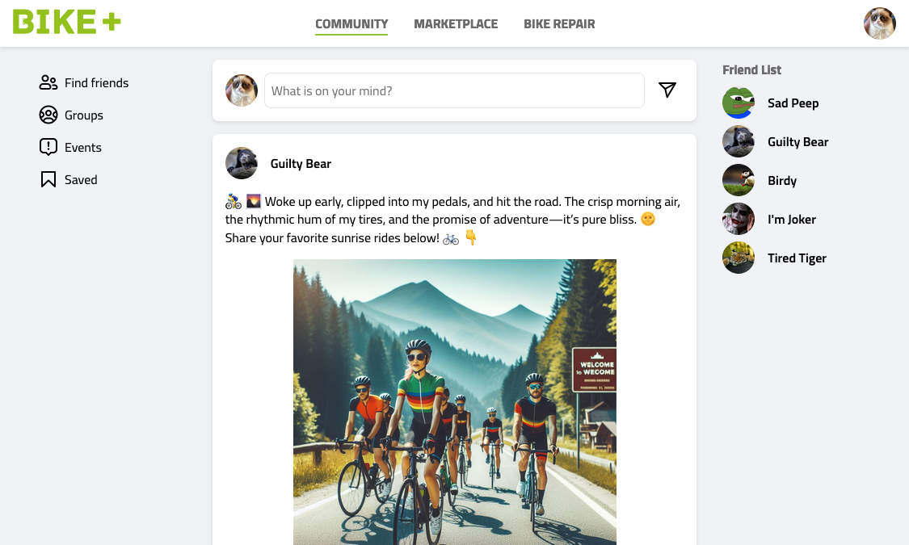
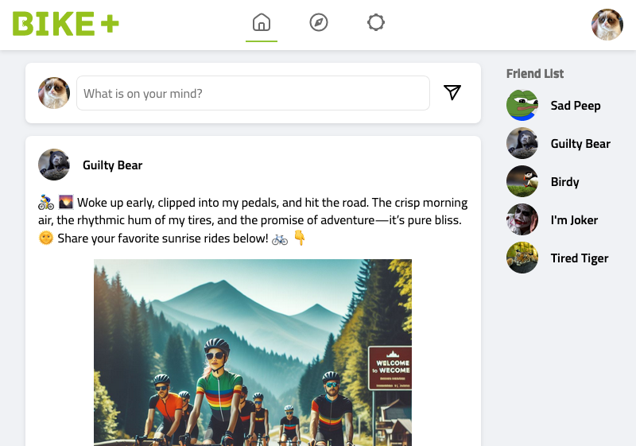
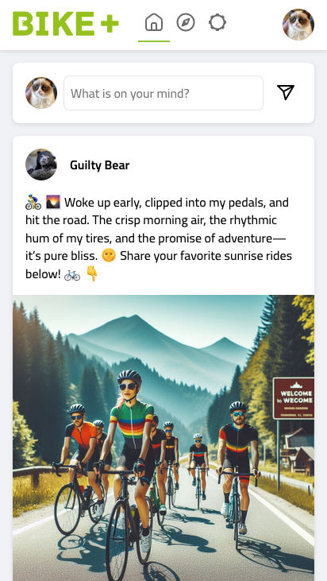
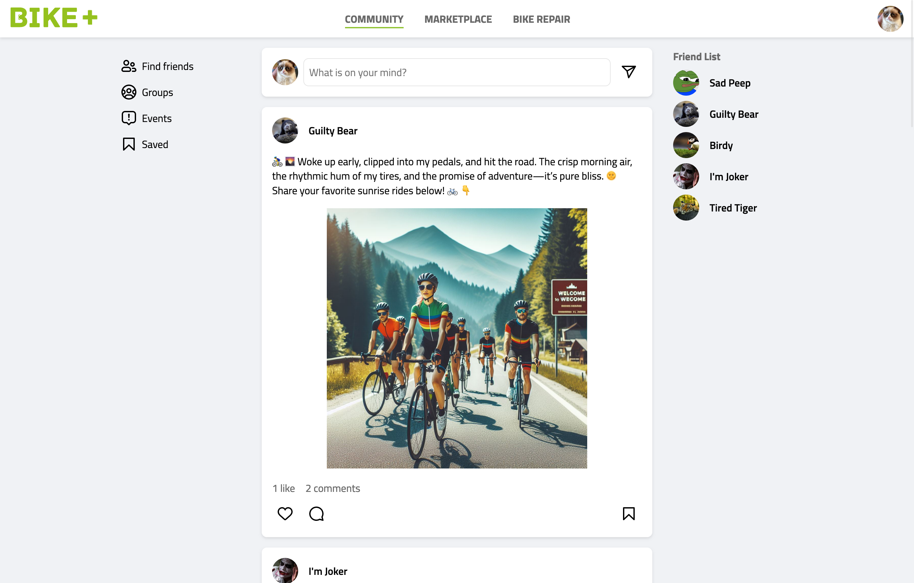
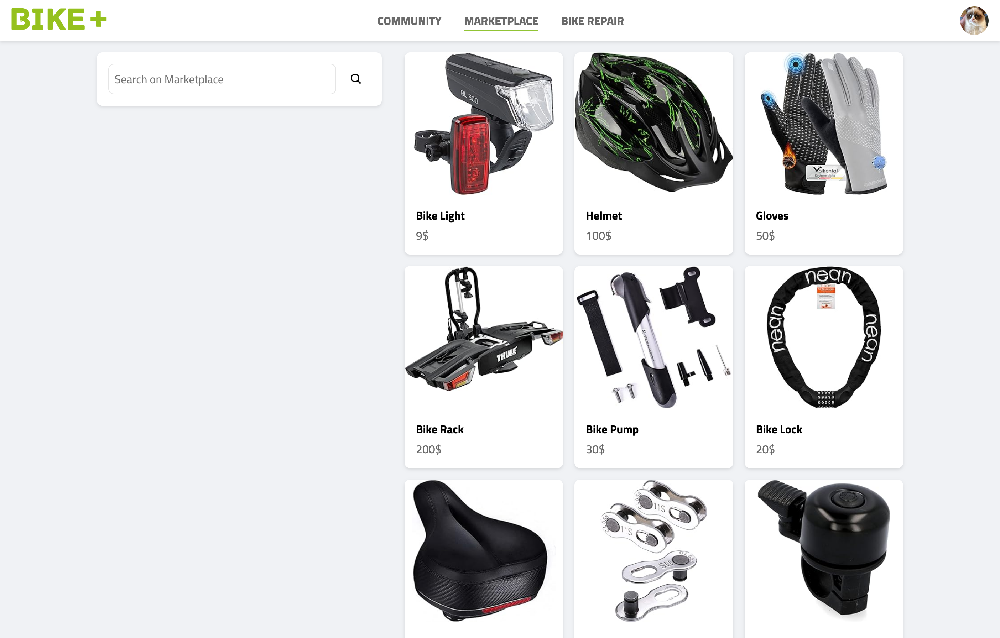
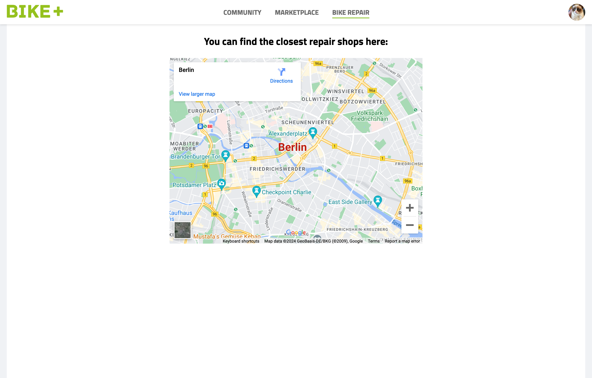
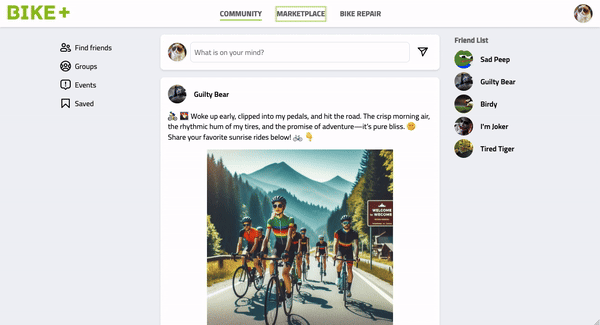
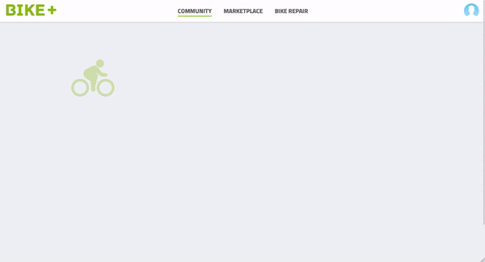
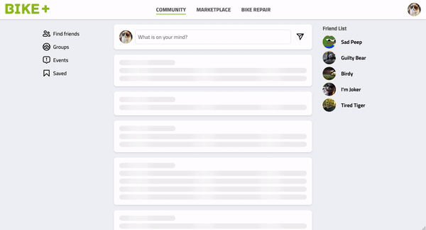

# Bike Plus (prototype)

Live demo: https://bikeplus.netlify.app/

BikePlus is the hub for bike lovers. Share your favorite routes, swap gear recommendations, organize group rides, and buy/sell bike accessories.

## Notes

- The app simulates data fetching from a remote server using a custom hook called `useFetchMockData`. It is a simple timeout function that returns static JSON data.
- There is no data persistence; refreshing the page should reset the data.
- As this is merely a prototype app, most of the functions do not operate as expected for regular usage.

## Prerequisites

To ensure compatibility, please follow these steps:

1. Use Node.js version 18:

```
nvm use
```

2. Install `pnpm` as the package manager:

```
npm install -g pnpm
```

## Getting Started

1. Install project dependencies:

```
pnpm install
```

2. Start the app:

```
pnpm start
```

## Tech Stack

- Library: React 18
- Styling: CSS modules
- Package Manager: pnpm
- Build Tool: Vite
- Code Formatting: eslint, prettier
- Routing: react-router
- Data Management: React Context with useReducer hook
- Deployment: Netlify
- Use Titillium Web font via Google fonts
- Use [NormalizeCSS](https://github.com/necolas/normalize.css/)
- No components library is being used

## Folder structure

- `components/`: contains all the reusable components
- `contexts/`: provide context with mock data
- `pages/`: page components
- `hooks/`: custom React hooks
- `assets/`: contains static files like images and icons
- `utils/`: contains utility functions that are used across the application

## Responsive Design

The app supports mobile, tablet and desktop viewports.


### Desktop viewport



### Tablet viewport



### Mobile viewport



## Screens

### Community

- Description: the homepage allows users to post, comment, and share anything related to bikes. Essentially, it’s a social network for bike enthusiasts.
- Supported features: Add a new post and remove your own posts.



### Marketplace

- Description: The Marketplace page allows users to buy or sell new or used bike accessories.
- Supported feature: Search for items.



### Bike Repair

- Description: The Bike Repair page gives you access to the closest bike repair shop.
- No features yet available



### Accessibility

- Use semantic HTML
- Provide alternative text for images
- Ensure sufficient color contrast
- Keyboard interaction
  

### Performance / User experience

- Code spitting with dynamic import
- Page loading: when the page loads or switching between pages
  
- Skeleton loading: when feeds are loading or adding a new post
  
- Infinite scroll (experimental):
  
  - Note: this feature is experimental and not fully tested yet
  - Working branch: `feat/infinite-scroll`
  - Live demo: https://deploy-preview-1--bikeplus.netlify.app/

## Improvement

- Cover with tests
- Extract reducer logic from `App.tsx` into a custom hook
- Complete the infinite scroll feature
- Other features: side navigation, detail page, login/logout...
